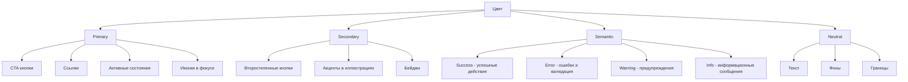
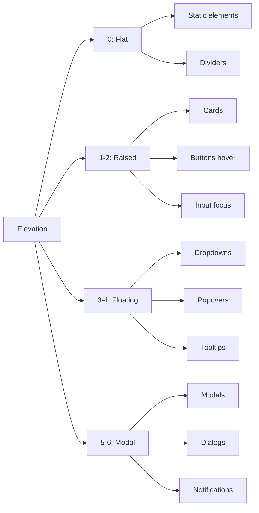
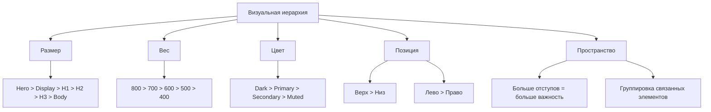

# Дизайн-система L_Shop

## Содержание

1. [Введение](#введение)
2. [Аудит текущего состояния](#аудит-текущего-состояния)
3. [Цветовая палитра](#цветовая-палитра)
4. [Типографика](#типографика)
5. [Система отступов](#система-отступов)
6. [Тени и глубина](#тени-и-глубина)
7. [Скругления](#скругления)
8. [Микро-взаимодействия](#микро-взаимодействия)
9. [Визуальная иерархия](#визуальная-иерархия)
10. [Применение в компонентах](#применение-в-компонентах)

---

## Введение

Данный документ описывает дизайн-систему проекта L_Shop — e-commerce платформы с фронтендом на TypeScript без фреймворков. Дизайн-система построена на принципах:

- **Консистентность** — единообразие визуального языка
- **Масштабируемость** — лёгкое добавление новых компонентов
- **Доступность** — соответствие WCAG 2.1 AA
- **Производительность** — оптимизация CSS-переменных

---

## Аудит текущего состояния

### Выявленные проблемы

#### Критические

| Проблема | Файл | Описание |
|----------|------|----------|
| Hardcoded цвета | `button.css:96-102` | `#dc2626`, `#b91c1c` вместо CSS-переменных |
| Отсутствует secondary цвет | `variables.css` | Нет акцентного цвета для разнообразия |
| Нет info-цвета | `variables.css` | Только success, error, warning |

#### Средние

| Проблема | Файл | Описание |
|----------|------|----------|
| Ограниченная типографика | `variables.css:40-52` | Только 6 размеров, нет hero/display |
| Нет letter-spacing | `variables.css` | Отсутствуют переменные межбуквенного интервала |
| Неполная система отступов | `variables.css:54-60` | Нет 3xl, полупробелов |

#### Минорные

| Проблема | Файл | Описание |
|----------|------|----------|
| Только 4 уровня теней | `variables.css:69-73` | Нужен 5-й уровень |
| Нет градиентов | `variables.css` | Отсутствуют переменные градиентов |
| Простые timing-функции | `variables.css:75-78` | Только ease, нет spring |

### Положительные стороны

- ✅ Хорошая структура CSS-переменных
- ✅ БЭМ-подобная методология именования
- ✅ Базовая адаптивность с media queries
- ✅ Подготовка к Dark Mode
- ✅ Focus-visible состояния для доступности

---

## Цветовая палитра

### Primary цвета

Основной брендовый цвет — синий. Используется для основных действий, ссылок, акцентов.

```css
/* Primary - основной брендовый */
--color-primary-50: #eff6ff;   /* Самый светлый - фон hover */
--color-primary-100: #dbeafe;  /* Светлый фон */
--color-primary-200: #bfdbfe;  /* Border light */
--color-primary-300: #93c5fd;  /* Border default */
--color-primary-400: #60a5fa;  /* Icon active */
--color-primary-500: #3b82f6;  /* Базовый primary */
--color-primary-600: #2563eb;  /* Hover state */
--color-primary-700: #1d4ed8;  /* Active state */
--color-primary-800: #1e40af;  /* Dark accent */
--color-primary-900: #1e3a8a;  /* Самый тёмный */
```

### Secondary цвета

Вторичный цвет — фиолетовый. Используется для второстепенных действий, выделения.

```css
/* Secondary - вторичный акцент */
--color-secondary-50: #faf5ff;
--color-secondary-100: #f3e8ff;
--color-secondary-200: #e9d5ff;
--color-secondary-300: #d8b4fe;
--color-secondary-400: #c084fc;
--color-secondary-500: #a855f7;  /* Базовый secondary */
--color-secondary-600: #9333ea;  /* Hover state */
--color-secondary-700: #7c3aed;  /* Active state */
--color-secondary-800: #6b21a8;
--color-secondary-900: #581c87;
```

### Neutral цвета

Нейтральные цвета для текста, фонов, границ.

```css
/* Neutral - нейтральные */
--color-neutral-0: #ffffff;    /* Чистый белый */
--color-neutral-50: #f8fafc;   /* Фон страницы */
--color-neutral-100: #f1f5f9;  /* Фон секций */
--color-neutral-200: #e2e8f0;  /* Border default */
--color-neutral-300: #cbd5e1;  /* Border hover */
--color-neutral-400: #94a3b8;  /* Text muted */
--color-neutral-500: #64748b;  /* Text secondary */
--color-neutral-600: #475569;  /* Text primary light */
--color-neutral-700: #334155;  /* Text primary */
--color-neutral-800: #1e293b;  /* Heading */
--color-neutral-900: #0f172a;  /* Text darkest */
```

### Semantic цвета

Семантические цвета для статусов и обратной связи.

```css
/* Success - успех */
--color-success-50: #f0fdf4;
--color-success-100: #dcfce7;
--color-success-500: #22c55e;  /* Базовый */
--color-success-600: #16a34a;  /* Hover */
--color-success-700: #15803d;  /* Active */

/* Error - ошибка */
--color-error-50: #fef2f2;
--color-error-100: #fee2e2;
--color-error-500: #ef4444;    /* Базовый */
--color-error-600: #dc2626;    /* Hover */
--color-error-700: #b91c1c;    /* Active */

/* Warning - предупреждение */
--color-warning-50: #fffbeb;
--color-warning-100: #fef3c7;
--color-warning-500: #f59e0b;  /* Базовый */
--color-warning-600: #d97706;  /* Hover */
--color-warning-700: #b45309;  /* Active */

/* Info - информация */
--color-info-50: #eff6ff;
--color-info-100: #dbeafe;
--color-info-500: #0ea5e9;     /* Базовый */
--color-info-600: #0284c7;     /* Hover */
--color-info-700: #0369a1;     /* Active */
```

### Градиенты

Градиенты для акцентов и фонов.

```css
/* Градиенты */
--gradient-primary: linear-gradient(135deg, #3b82f6 0%, #2563eb 100%);
--gradient-primary-hover: linear-gradient(135deg, #2563eb 0%, #1d4ed8 100%);
--gradient-secondary: linear-gradient(135deg, #a855f7 0%, #9333ea 100%);
--gradient-hero: linear-gradient(135deg, #f8fafc 0%, #ffffff 100%);
--gradient-card: linear-gradient(180deg, #ffffff 0%, #f8fafc 100%);
--gradient-dark: linear-gradient(135deg, #1e293b 0%, #0f172a 100%);
```

### Правила использования цветов



---

## Типографика

### Шрифтовая пара

```css
/* Основной шрифт - Inter */
--font-family-primary: 'Inter', -apple-system, BlinkMacSystemFont, 'Segoe UI', Roboto, sans-serif;

/* Моноширинный шрифт - для кода */
--font-family-mono: 'JetBrains Mono', 'Fira Code', Consolas, monospace;
```

### Шкала размеров

Используем модульная шкала с ratio 1.25 (major third).

```css
/* Шкала типографики */
--font-size-2xs: 0.625rem;   /* 10px - мелкие подписи */
--font-size-xs: 0.75rem;     /* 12px - caption, helper */
--font-size-sm: 0.875rem;    /* 14px - small text, buttons */
--font-size-base: 1rem;      /* 16px - body text */
--font-size-lg: 1.125rem;    /* 18px - lead text */
--font-size-xl: 1.25rem;     /* 20px - h4 */
--font-size-2xl: 1.5rem;     /* 24px - h3 */
--font-size-3xl: 1.875rem;   /* 30px - h2 */
--font-size-4xl: 2.25rem;    /* 36px - h1 */
--font-size-5xl: 3rem;       /* 48px - display */
--font-size-6xl: 3.75rem;    /* 60px - hero */
```

### Вес шрифтов

```css
--font-weight-light: 300;
--font-weight-normal: 400;
--font-weight-medium: 500;
--font-weight-semibold: 600;
--font-weight-bold: 700;
--font-weight-extrabold: 800;
```

### Межстрочный интервал

```css
--line-height-none: 1;
--line-height-tight: 1.25;
--line-height-snug: 1.375;
--line-height-normal: 1.5;
--line-height-relaxed: 1.625;
--line-height-loose: 2;
```

### Letter-spacing

```css
--letter-spacing-tighter: -0.05em;
--letter-spacing-tight: -0.025em;
--letter-spacing-normal: 0;
--letter-spacing-wide: 0.025em;
--letter-spacing-wider: 0.05em;
--letter-spacing-widest: 0.1em;
```

### Типографические стили

| Стиль | Размер | Вес | Line-height | Letter-spacing | Использование |
|-------|--------|-----|-------------|----------------|---------------|
| Hero | 60px / 3.75rem | 800 | 1.1 | -0.025em | Главный заголовок страницы |
| Display | 48px / 3rem | 700 | 1.2 | -0.025em | Большие секции |
| H1 | 36px / 2.25rem | 700 | 1.2 | -0.025em | Заголовок страницы |
| H2 | 30px / 1.875rem | 600 | 1.25 | -0.025em | Заголовок секции |
| H3 | 24px / 1.5rem | 600 | 1.3 | 0 | Подзаголовок |
| H4 | 20px / 1.25rem | 600 | 1.4 | 0 | Малый заголовок |
| Body Large | 18px / 1.125rem | 400 | 1.6 | 0 | Важный текст |
| Body | 16px / 1rem | 400 | 1.5 | 0 | Основной текст |
| Body Small | 14px / 0.875rem | 400 | 1.5 | 0 | Вторичный текст |
| Caption | 12px / 0.75rem | 500 | 1.4 | 0.025em | Подписи, hints |
| Overline | 10px / 0.625rem | 600 | 1.2 | 0.1em | Метки над заголовками |

---

## Система отступов

### 8px Grid System

Все отступы кратны 8px для визуальной гармонии.

```css
/* Базовая единица - 8px */
--spacing-unit: 8px;

/* Шкала отступов */
--spacing-0: 0;
--spacing-1: 0.25rem;    /* 4px - 0.5 unit */
--spacing-2: 0.5rem;     /* 8px - 1 unit */
--spacing-3: 0.75rem;    /* 12px - 1.5 units */
--spacing-4: 1rem;       /* 16px - 2 units */
--spacing-5: 1.25rem;    /* 20px - 2.5 units */
--spacing-6: 1.5rem;     /* 24px - 3 units */
--spacing-8: 2rem;       /* 32px - 4 units */
--spacing-10: 2.5rem;    /* 40px - 5 units */
--spacing-12: 3rem;      /* 48px - 6 units */
--spacing-16: 4rem;      /* 64px - 8 units */
--spacing-20: 5rem;      /* 80px - 10 units */
--spacing-24: 6rem;      /* 96px - 12 units */
--spacing-32: 8rem;      /* 128px - 16 units */
```

### Семантические отступы

```css
/* Семантические алиасы */
--spacing-xs: var(--spacing-1);     /* 4px */
--spacing-sm: var(--spacing-2);     /* 8px */
--spacing-md: var(--spacing-4);     /* 16px */
--spacing-lg: var(--spacing-6);     /* 24px */
--spacing-xl: var(--spacing-8);     /* 32px */
--spacing-2xl: var(--spacing-12);   /* 48px */
--spacing-3xl: var(--spacing-16);   /* 64px */
```

### Padding компонентов

| Компонент | Padding | Значение |
|-----------|---------|----------|
| Button Small | py-1.5 px-3 | 6px 12px |
| Button Medium | py-2 px-4 | 8px 16px |
| Button Large | py-3 px-6 | 12px 24px |
| Input | py-2 px-4 | 8px 16px |
| Card | p-6 | 24px |
| Modal Small | p-6 | 24px |
| Modal Medium | p-8 | 32px |
| Modal Large | p-10 | 40px |
| Section | py-16 | 64px vertical |
| Container | px-4 | 16px horizontal |

### Margins между элементами

| Элементы | Margin | Значение |
|----------|--------|----------|
| Label → Input | mb-1.5 | 6px |
| Input → Helper | mt-1.5 | 6px |
| Form fields | mb-4 | 16px |
| Card header → body | mb-4 | 16px |
| Section title → content | mb-6 | 24px |
| Paragraphs | mb-4 | 16px |
| H1 → content | mb-6 | 24px |
| H2 → content | mb-4 | 16px |
| H3 → content | mb-3 | 12px |

---

## Тени и глубина

### Уровни теней (Elevation)

```css
/* Elevation 0 - нет тени, плоский */
--shadow-0: none;

/* Elevation 1 - лёгкая тень, hover states */
--shadow-1: 0 1px 2px rgba(0, 0, 0, 0.05);

/* Elevation 2 - стандартная тень, cards */
--shadow-2: 0 1px 3px rgba(0, 0, 0, 0.1), 
            0 1px 2px rgba(0, 0, 0, 0.06);

/* Elevation 3 - средняя тень, dropdowns */
--shadow-3: 0 4px 6px -1px rgba(0, 0, 0, 0.1), 
            0 2px 4px -1px rgba(0, 0, 0, 0.06);

/* Elevation 4 - высокая тень, popovers */
--shadow-4: 0 10px 15px -3px rgba(0, 0, 0, 0.1), 
            0 4px 6px -2px rgba(0, 0, 0, 0.05);

/* Elevation 5 - максимальная тень, modals */
--shadow-5: 0 20px 25px -5px rgba(0, 0, 0, 0.1), 
            0 10px 10px -5px rgba(0, 0, 0, 0.04);

/* Elevation 6 - floating elements */
--shadow-6: 0 25px 50px -12px rgba(0, 0, 0, 0.25);
```

### Специальные тени

```css
/* Тень для primary кнопок */
--shadow-primary: 0 4px 14px rgba(59, 130, 246, 0.4);
--shadow-primary-hover: 0 6px 20px rgba(59, 130, 246, 0.5);

/* Тень для error состояний */
--shadow-error: 0 4px 14px rgba(239, 68, 68, 0.4);

/* Inner shadow для input focus */
--shadow-focus: 0 0 0 3px rgba(59, 130, 246, 0.3);
--shadow-focus-error: 0 0 0 3px rgba(239, 68, 68, 0.3);
--shadow-focus-success: 0 0 0 3px rgba(34, 197, 94, 0.3);
```

### Применение теней



---

## Скругления

### Шкала скруглений

```css
/* Скругления */
--radius-0: 0;
--radius-1: 0.25rem;     /* 4px */
--radius-2: 0.375rem;    /* 6px */
--radius-3: 0.5rem;      /* 8px */
--radius-4: 0.75rem;     /* 12px */
--radius-5: 1rem;        /* 16px */
--radius-6: 1.5rem;      /* 24px */
--radius-full: 9999px;   /* Полное скругление */
```

### Семантические алиасы

```css
--radius-sm: var(--radius-1);    /* 4px - badges, tags */
--radius-md: var(--radius-3);    /* 8px - buttons, inputs */
--radius-lg: var(--radius-4);    /* 12px - cards */
--radius-xl: var(--radius-5);    /* 16px - modals */
--radius-2xl: var(--radius-6);   /* 24px - large cards */
```

### Применение скруглений

| Компонент | Border-radius | Значение |
|-----------|---------------|----------|
| Button Small | radius-1 | 4px |
| Button Medium | radius-2 | 6px |
| Button Large | radius-3 | 8px |
| Input | radius-2 | 6px |
| Card | radius-4 | 12px |
| Modal | radius-5 | 16px |
| Avatar Small | radius-full | 50% |
| Avatar Large | radius-4 | 12px |
| Badge | radius-full | 9999px |
| Tag | radius-1 | 4px |
| Tooltip | radius-2 | 6px |

---

## Микро-взаимодействия

### Timing функции

```css
/* Timing функции */
--ease-linear: linear;
--ease-in: cubic-bezier(0.4, 0, 1, 1);
--ease-out: cubic-bezier(0, 0, 0.2, 1);
--ease-in-out: cubic-bezier(0.4, 0, 0.2, 1);

/* Spring эффекты */
--ease-spring: cubic-bezier(0.175, 0.885, 0.32, 1.275);
--ease-bounce: cubic-bezier(0.68, -0.55, 0.265, 1.55);

/* Smooth переходы */
--ease-smooth: cubic-bezier(0.25, 0.1, 0.25, 1);
--ease-sharp: cubic-bezier(0.4, 0, 0.6, 1);
```

### Длительности

```css
/* Длительности анимаций */
--duration-instant: 0ms;
--duration-fast: 150ms;
--duration-normal: 250ms;
--duration-slow: 350ms;
--duration-slower: 500ms;
--duration-slowest: 700ms;
```

### Переходы

```css
/* Готовые переходы */
--transition-colors: color var(--duration-fast) var(--ease-out),
                     background-color var(--duration-fast) var(--ease-out),
                     border-color var(--duration-fast) var(--ease-out);

--transition-opacity: opacity var(--duration-fast) var(--ease-out);

--transition-shadow: box-shadow var(--duration-normal) var(--ease-out);

--transition-transform: transform var(--duration-normal) var(--ease-out);

--transition-all: all var(--duration-normal) var(--ease-out);

/* Специализированные переходы */
--transition-button: background-color var(--duration-fast) var(--ease-out),
                     border-color var(--duration-fast) var(--ease-out),
                     box-shadow var(--duration-fast) var(--ease-out);

--transition-input: border-color var(--duration-fast) var(--ease-out),
                    box-shadow var(--duration-fast) var(--ease-out);

--transition-modal: opacity var(--duration-normal) var(--ease-out),
                    transform var(--duration-normal) var(--ease-out),
                    visibility var(--duration-normal) var(--ease-out);
```

### Состояния интерактивных элементов

#### Button states

| Состояние | Изменения |
|-----------|-----------|
| Default | Базовый цвет, тень elevation-1 |
| Hover | Цвет темнее на 1 шаг, тень elevation-2 |
| Active | Цвет темнее на 2 шага, тень elevation-1, scale(0.98) |
| Focus | outline 2px primary, outline-offset 2px |
| Disabled | opacity 0.6, cursor not-allowed |
| Loading | цвет прозрачный, spinner по центру |

#### Input states

| Состояние | Изменения |
|-----------|-----------|
| Default | border neutral-200, bg white |
| Hover | border neutral-300 |
| Focus | border primary-500, shadow-focus |
| Error | border error-500, shadow-focus-error |
| Success | border success-500, shadow-focus-success |
| Disabled | bg neutral-100, text neutral-400 |

### Анимации

```css
/* Keyframes */
@keyframes fadeIn {
  from { opacity: 0; }
  to { opacity: 1; }
}

@keyframes fadeOut {
  from { opacity: 1; }
  to { opacity: 0; }
}

@keyframes slideInUp {
  from {
    opacity: 0;
    transform: translateY(16px);
  }
  to {
    opacity: 1;
    transform: translateY(0);
  }
}

@keyframes slideInDown {
  from {
    opacity: 0;
    transform: translateY(-16px);
  }
  to {
    opacity: 1;
    transform: translateY(0);
  }
}

@keyframes scaleIn {
  from {
    opacity: 0;
    transform: scale(0.95);
  }
  to {
    opacity: 1;
    transform: scale(1);
  }
}

@keyframes spin {
  from { transform: rotate(0deg); }
  to { transform: rotate(360deg); }
}

@keyframes pulse {
  0%, 100% { opacity: 1; }
  50% { opacity: 0.5; }
}

@keyframes shake {
  0%, 100% { transform: translateX(0); }
  25% { transform: translateX(-4px); }
  75% { transform: translateX(4px); }
}
```

---

## Визуальная иерархия

### Принципы построения иерархии

1. **Контраст размеров** — заголовки значительно крупнее body текста
2. **Контраст весов** — заголовки bold, основной текст normal
3. **Контраст цветов** — заголовки темнее, вторичный текст светлее
4. **Контраст позиций** — важные элементы выше и левее
5. **Пространственный контраст** — больше отступов = больше важность

### Соотношение размеров заголовков

```
Hero (60px) : Display (48px) : H1 (36px) : H2 (30px) : H3 (24px) : Body (16px)
    3.75    :      3.0       :    2.25   :    1.875  :    1.5   :    1.0
```

### Контраст весов

| Элемент | Вес | Отношение к body |
|---------|-----|------------------|
| Hero, Display | 800 | +400 |
| H1, H2 | 700 | +300 |
| H3, H4 | 600 | +200 |
| Body | 400 | 0 |
| Caption | 500 | +100 |

### Контраст цветов

| Элемент | Цвет | Luminance |
|---------|------|-----------|
| Heading | neutral-900 | 0.98 |
| Body | neutral-700 | 0.82 |
| Secondary | neutral-500 | 0.55 |
| Muted | neutral-400 | 0.45 |
| Disabled | neutral-300 | 0.35 |

### Правила визуальной иерархии



---

## Применение в компонентах

### Button

```css
.btn {
  /* Базовые стили */
  display: inline-flex;
  align-items: center;
  justify-content: center;
  gap: var(--spacing-2);
  font-family: var(--font-family-primary);
  font-weight: var(--font-weight-medium);
  line-height: var(--line-height-none);
  text-decoration: none;
  border: 1px solid transparent;
  cursor: pointer;
  transition: var(--transition-button);
  white-space: nowrap;
  user-select: none;
}

/* Primary */
.btn--primary {
  background-color: var(--color-primary-600);
  color: var(--color-neutral-0);
  border-color: var(--color-primary-600);
  box-shadow: var(--shadow-1);
}

.btn--primary:hover {
  background-color: var(--color-primary-700);
  border-color: var(--color-primary-700);
  box-shadow: var(--shadow-2);
}

.btn--primary:active {
  background-color: var(--color-primary-800);
  border-color: var(--color-primary-800);
  transform: scale(0.98);
}

/* Sizes */
.btn--sm {
  padding: var(--spacing-1.5) var(--spacing-3);
  font-size: var(--font-size-xs);
  border-radius: var(--radius-1);
}

.btn--md {
  padding: var(--spacing-2) var(--spacing-4);
  font-size: var(--font-size-sm);
  border-radius: var(--radius-2);
}

.btn--lg {
  padding: var(--spacing-3) var(--spacing-6);
  font-size: var(--font-size-base);
  border-radius: var(--radius-3);
}
```

### Input

```css
.input {
  display: block;
  width: 100%;
  padding: var(--spacing-2) var(--spacing-4);
  font-family: var(--font-family-primary);
  font-size: var(--font-size-base);
  line-height: var(--line-height-normal);
  color: var(--color-neutral-700);
  background-color: var(--color-neutral-0);
  border: 1px solid var(--color-neutral-200);
  border-radius: var(--radius-2);
  transition: var(--transition-input);
}

.input::placeholder {
  color: var(--color-neutral-400);
}

.input:hover:not(:disabled):not(:focus) {
  border-color: var(--color-neutral-300);
}

.input:focus {
  outline: none;
  border-color: var(--color-primary-500);
  box-shadow: var(--shadow-focus);
}

.input--error {
  border-color: var(--color-error-500);
}

.input--error:focus {
  box-shadow: var(--shadow-focus-error);
}
```

### Card

```css
.card {
  background-color: var(--color-neutral-0);
  border: 1px solid var(--color-neutral-200);
  border-radius: var(--radius-4);
  padding: var(--spacing-6);
  box-shadow: var(--shadow-1);
  transition: var(--transition-shadow), var(--transition-transform);
}

.card:hover {
  box-shadow: var(--shadow-3);
}

.card--interactive:hover {
  transform: translateY(-2px);
  box-shadow: var(--shadow-4);
}
```

### Modal

```css
.modal {
  position: fixed;
  top: 50%;
  left: 50%;
  transform: translate(-50%, -50%) scale(0.95);
  z-index: var(--z-modal);
  width: 90%;
  max-width: 480px;
  max-height: 90vh;
  background-color: var(--color-neutral-0);
  border-radius: var(--radius-5);
  box-shadow: var(--shadow-6);
  opacity: 0;
  visibility: hidden;
  transition: var(--transition-modal);
}

.modal--visible {
  opacity: 1;
  visibility: visible;
  transform: translate(-50%, -50%) scale(1);
}
```

---

## Чеклист внедрения

- [ ] Заменить все hardcoded цвета на CSS-переменные
- [ ] Добавить secondary цвет в палитру
- [ ] Добавить info-цвет в semantic палитру
- [ ] Расширить шкалу типографики до 6xl
- [ ] Добавить letter-spacing переменные
- [ ] Расширить систему отступов до spacing-32
- [ ] Добавить elevation-5 и elevation-6
- [ ] Добавить градиенты
- [ ] Добавить spring/bounce timing функции
- [ ] Протестировать все состояния компонентов
- [ ] Проверить контрастность цветов (WCAG AA)
- [ ] Документировать все изменения

---

## Версионирование

| Версия | Дата | Изменения |
|--------|------|-----------|
| 1.0.0 | 2026-02-19 | Начальная версия дизайн-системы |