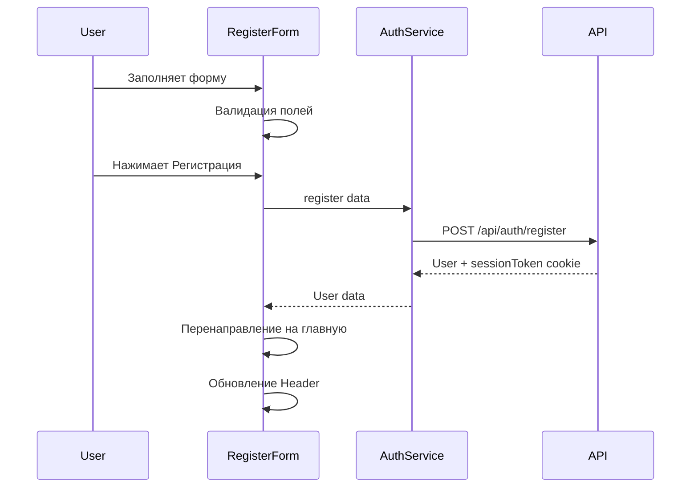
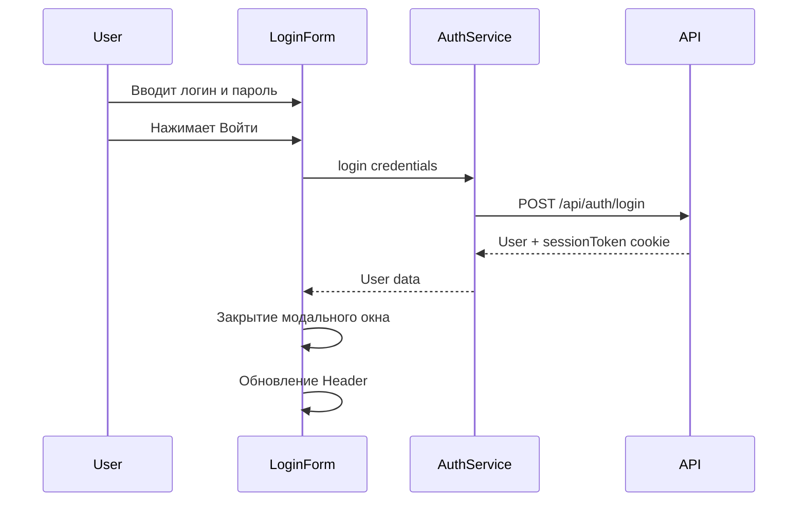

# План разработки фронтенда L_Shop

## Требования из ТЗ

### Общие требования
- SPA (одностраничное приложение)
- TypeScript (запрещён тип `any`)
- Компонентный подход
- URL-маршрутизация
- Data-атрибуты для тестирования

### Data-атрибуты
| Атрибут | Элемент |
|---------|---------|
| `data-title` | Название товара на главной |
| `data-price` | Цена товара на главной |
| `data-title="basket"` | Название товара в корзине |
| `data-price="basket"` | Цена товара в корзине |
| `data-registration` | Форма регистрации |
| `data-delivery` | Форма доставки |

### Функционал авторизации (ответственность Глеба)
1. Форма регистрации с полями: имя, email, логин, телефон, пароль
2. Форма авторизации
3. После входа: отображение активной корзины и доставок
4. Автоматический разлогин через 10 минут

---

## Архитектура фронтенда

### Структура файлов

```
src/frontend/
├── index.html                 # Точка входа HTML
├── styles/
│   ├── main.css              # Основные стили
│   ├── variables.css         # CSS-переменные (цвета, шрифты, отступы)
│   ├── components/           # Стили компонентов
│   │   ├── button.css
│   │   ├── input.css
│   │   ├── modal.css
│   │   ├── header.css
│   │   └── forms.css
│   └── pages/                # Стили страниц
│       ├── auth.css
│       ├── main.css
│       ├── cart.css
│       └── delivery.css
├── types/
│   ├── user.ts               # Типы пользователя
│   ├── product.ts            # Типы продукта
│   ├── cart.ts               # Типы корзины
│   ├── order.ts              # Типы заказа
│   └── api.ts                # Типы API ответов
├── services/
│   ├── api.ts                # Базовый API клиент
│   ├── auth.service.ts       # Сервис авторизации
│   ├── product.service.ts    # Сервис продуктов
│   ├── cart.service.ts       # Сервис корзины
│   └── order.service.ts      # Сервис заказов
├── router/
│   ├── router.ts             # Класс маршрутизатора
│   └── routes.ts             # Определение маршрутов
├── store/
│   ├── store.ts              # Простое хранилище состояния
│   └── auth.store.ts         # Состояние авторизации
├── components/
│   ├── base/
│   │   ├── Component.ts      # Базовый класс компонента
│   │   ├── Button.ts         # Кнопка
│   │   ├── Input.ts          # Поле ввода
│   │   ├── Modal.ts          # Модальное окно
│   │   └── Header.ts         # Шапка сайта
│   ├── auth/
│   │   ├── LoginForm.ts      # Форма входа
│   │   ├── RegisterForm.ts   # Форма регистрации
│   │   └── AuthModal.ts      # Модальное окно авторизации
│   ├── product/
│   │   ├── ProductCard.ts    # Карточка товара
│   │   ├── ProductList.ts    # Список товаров
│   │   └── ProductFilters.ts # Фильтры товаров
│   ├── cart/
│   │   ├── CartItem.ts       # Элемент корзины
│   │   ├── CartList.ts       # Список корзины
│   │   └── CartSummary.ts    # Итого корзины
│   └── order/
│       ├── DeliveryForm.ts   # Форма доставки
│       └── OrderSummary.ts   # Сводка заказа
├── pages/
│   ├── MainPage.ts           # Главная страница
│   ├── CartPage.ts           # Страница корзины
│   ├── DeliveryPage.ts       # Страница доставки
│   └── NotFoundPage.ts       # Страница 404
├── utils/
│   ├── validators.ts         # Валидация форм
│   ├── formatters.ts         # Форматирование данных
│   └── helpers.ts            # Вспомогательные функции
└── app.ts                    # Точка входа TypeScript
```

---

## Дизайн-система

### Цветовая палитра

```css
:root {
  /* Основные цвета */
  --color-primary: #2563eb;        /* Синий - основные действия */
  --color-primary-hover: #1d4ed8;  /* Синий при наведении */
  --color-primary-light: #dbeafe;  /* Светло-синий фон */
  
  /* Вторичные цвета */
  --color-secondary: #64748b;      /* Серый - вторичные элементы */
  --color-secondary-hover: #475569;
  
  /* Статусы */
  --color-success: #22c55e;        /* Зелёный - успех */
  --color-warning: #f59e0b;        /* Оранжевый - предупреждение */
  --color-error: #ef4444;          /* Красный - ошибка */
  
  /* Фоновые цвета */
  --color-bg-primary: #ffffff;     /* Основной фон */
  --color-bg-secondary: #f8fafc;   /* Вторичный фон */
  --color-bg-tertiary: #f1f5f9;    /* Третичный фон */
  
  /* Текст */
  --color-text-primary: #1e293b;   /* Основной текст */
  --color-text-secondary: #64748b; /* Вторичный текст */
  --color-text-muted: #94a3b8;     /* Приглушённый текст */
  
  /* Границы */
  --color-border: #e2e8f0;         /* Основная граница */
  --color-border-focus: #2563eb;   /* Граница при фокусе */
  
  /* Тени */
  --shadow-sm: 0 1px 2px rgba(0, 0, 0, 0.05);
  --shadow-md: 0 4px 6px rgba(0, 0, 0, 0.1);
  --shadow-lg: 0 10px 15px rgba(0, 0, 0, 0.1);
}
```

### Типографика

```css
:root {
  /* Шрифты */
  --font-family: 'Inter', -apple-system, BlinkMacSystemFont, 'Segoe UI', Roboto, sans-serif;
  
  /* Размеры шрифтов */
  --font-size-xs: 0.75rem;    /* 12px */
  --font-size-sm: 0.875rem;   /* 14px */
  --font-size-base: 1rem;     /* 16px */
  --font-size-lg: 1.125rem;   /* 18px */
  --font-size-xl: 1.25rem;    /* 20px */
  --font-size-2xl: 1.5rem;    /* 24px */
  --font-size-3xl: 1.875rem;  /* 30px */
  
  /* Межстрочный интервал */
  --line-height-tight: 1.25;
  --line-height-normal: 1.5;
  --line-height-relaxed: 1.75;
  
  /* Насыщенность */
  --font-weight-normal: 400;
  --font-weight-medium: 500;
  --font-weight-semibold: 600;
  --font-weight-bold: 700;
}
```

### Отступы и размеры

```css
:root {
  /* Отступы */
  --spacing-xs: 0.25rem;   /* 4px */
  --spacing-sm: 0.5rem;    /* 8px */
  --spacing-md: 1rem;      /* 16px */
  --spacing-lg: 1.5rem;    /* 24px */
  --spacing-xl: 2rem;      /* 32px */
  --spacing-2xl: 3rem;     /* 48px */
  
  /* Скругления */
  --radius-sm: 0.25rem;    /* 4px */
  --radius-md: 0.5rem;     /* 8px */
  --radius-lg: 0.75rem;    /* 12px */
  --radius-xl: 1rem;       /* 16px */
  --radius-full: 9999px;   /* Круглый */
  
  /* Ширина контейнера */
  --container-max-width: 1200px;
  --container-padding: 1rem;
}
```

---

## Компоненты

### 1. Базовый компонент (Component.ts)

```typescript
/**
 * Базовый класс для всех UI-компонентов
 */
export abstract class Component {
  protected element: HTMLElement;
  
  constructor(tagName: string = 'div', className: string = '') {
    this.element = document.createElement(tagName);
    if (className) {
      this.element.className = className;
    }
  }
  
  abstract render(): void;
  
  getElement(): HTMLElement {
    return this.element;
  }
  
  destroy(): void {
    this.element.remove();
  }
}
```

### 2. Форма регистрации (RegisterForm.ts)

**Поля:**
- Имя (text) - обязательное
- Email (email) - обязательное, валидация формата
- Логин (text) - обязательное
- Телефон (tel) - обязательное, формат +1234567890
- Пароль (password) - обязательное, минимум 6 символов
- Подтверждение пароля (password) - должно совпадать

**Data-атрибут:** `data-registration`

**Состояния:**
- Default - начальное состояние
- Loading - отправка данных
- Success - успешная регистрация
- Error - ошибка регистрации

**Валидация:**
- Реальтайм валидация при потере фокуса
- Показ ошибок под полями
- Блокировка кнопки при невалидной форме

### 3. Форма входа (LoginForm.ts)

**Поля:**
- Логин или Email (text) - обязательное
- Пароль (password) - обязательное

**Состояния:**
- Default
- Loading
- Error

### 4. Модальное окно авторизации (AuthModal.ts)

**Вкладки:**
- Вход
- Регистрация

**Поведение:**
- Открытие по клику на "Войти" в хедере
- Закрытие по клику на overlay или кнопку закрытия
- Закрытие по Escape
- Переключение между формами

### 5. Шапка сайта (Header.ts)

**Элементы:**
- Логотип (L_Shop)
- Навигация: Главная, Корзина, Доставки
- Для гостей: Кнопка "Войти"
- Для авторизованных: Имя пользователя + кнопка "Выйти"

**Состояние авторизации:**
- Проверка наличия сессии при загрузке
- Отображение имени пользователя
- Таймер до окончания сессии (опционально)

---

## Маршрутизация

### Определение маршрутов

```typescript
interface Route {
  path: string;
  component: typeof Page;
  authRequired?: boolean;
}

const routes: Route[] = [
  { path: '/', component: MainPage },
  { path: '/cart', component: CartPage, authRequired: true },
  { path: '/delivery', component: DeliveryPage, authRequired: true },
  { path: '/404', component: NotFoundPage },
];
```

### Router API

```typescript
class Router {
  navigate(path: string): void;
  getCurrentRoute(): Route;
  onRouteChange(callback: () => void): void;
}
```

---

## Сервисы

### API клиент (api.ts)

```typescript
class ApiClient {
  private baseUrl: string;
  
  async get<T>(path: string): Promise<T>;
  async post<T>(path: string, data: unknown): Promise<T>;
  async put<T>(path: string, data: unknown): Promise<T>;
  async delete<T>(path: string): Promise<T>;
}
```

### Сервис авторизации (auth.service.ts)

```typescript
interface AuthService {
  register(data: RegisterData): Promise<User>;
  login(login: string, password: string): Promise<User>;
  logout(): Promise<void>;
  getCurrentUser(): Promise<User | null>;
  isAuthenticated(): boolean;
}
```

---

## Страницы

### Главная страница (MainPage.ts)

**Для всех пользователей:**
- Список товаров с фильтрацией
- Поиск по названию/описанию
- Сортировка по цене
- Фильтр по категориям и наличию

**Для авторизованных:**
- Кнопка "Добавить в корзину" на карточках
- Счётчик товаров в корзине в хедере

### Страница корзины (CartPage.ts)

**Только для авторизованных:**
- Список товаров в корзине
- Изменение количества
- Удаление товаров
- Кнопка "Оформить доставку"

### Страница доставки (DeliveryPage.ts)

**Только для авторизованных:**
- Форма доставки (адрес, телефон, email)
- Выбор способа оплаты
- Подтверждение заказа

---

## Потоки данных

### Регистрация



### Вход



---

## Обработка ошибок

### Типы ошибок

```typescript
interface ApiError {
  message: string;
  error: string;  // Код ошибки
}

// Коды ошибок авторизации
const AUTH_ERRORS = {
  MISSING_FIELDS: 'Заполните все обязательные поля',
  INVALID_EMAIL: 'Некорректный формат email',
  INVALID_PHONE: 'Некорректный формат телефона',
  WEAK_PASSWORD: 'Пароль должен содержать минимум 6 символов',
  EMAIL_EXISTS: 'Пользователь с таким email уже существует',
  LOGIN_EXISTS: 'Пользователь с таким логином уже существует',
  INVALID_CREDENTIALS: 'Неверный логин или пароль',
  SESSION_EXPIRED: 'Сессия истекла. Войдите заново',
};
```

### Отображение ошибок

- Ошибки валидации - под соответствующими полями
- Ошибки API - в виде toast-уведомлений
- Ошибки сети - модальное окно с предложением повторить

---

## План реализации

### Этап 1: Базовая инфраструктура
1. Создать структуру папок
2. Настроить сборку (Vite или webpack)
3. Создать базовые стили (variables.css, main.css)
4. Реализовать базовый компонент

### Этап 2: Маршрутизация и состояние
1. Реализовать Router
2. Создать простое хранилище состояния
3. Реализовать API клиент

### Этап 3: Компоненты авторизации
1. Header с кнопкой входа
2. Modal компонент
3. LoginForm
4. RegisterForm
5. AuthModal

### Этап 4: Интеграция
1. Подключение к backend API
2. Обработка ошибок
3. Автоматический разлогин

### Этап 5: Тестирование
1. Проверка data-атрибутов
2. Тестирование валидации
3. Тестирование маршрутизации

---

## Чек-лист для Глеба

### Обязательные элементы
- [ ] Форма регистрации с data-registration
- [ ] Форма авторизации
- [ ] Валидация всех полей
- [ ] Обработка ошибок API
- [ ] Автоматический разлогин через 10 минут
- [ ] Header с отображением состояния авторизации
- [ ] URL-маршрутизация

### Рекомендуемые элементы
- [ ] Toast-уведомления
- [ ] Loading-состояния кнопок
- [ ] Анимации модальных окон
- [ ] Адаптивная вёрстка
- [ ] Индикатор времени до окончания сессии
