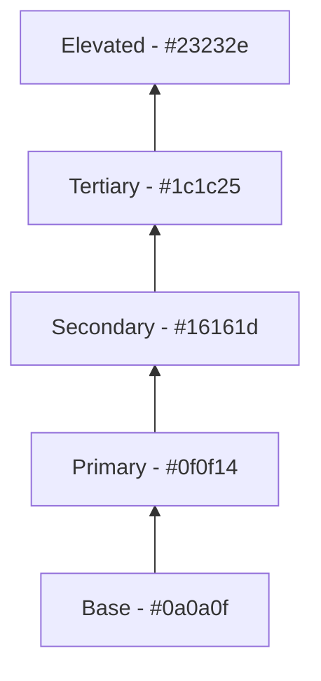

# План: Система дизайн-токенов для Dark Theme

## Анализ текущего состояния

### Существующая структура ([`design-tokens.css`](src/frontend/styles/design-tokens.css))

**Что уже есть:**
- Цветовая палитра: primary, secondary, neutral, success, error, warning, info
- Типографика: font families, sizes, weights, line heights, letter spacing
- Система отступов: 8px grid с шкалой от 0 до 32
- Тени: 6 уровней + специализированные (primary, error, success, focus)
- Скругления: от 0 до full (9999px)
- Переходы: timing functions, durations, готовые transitions
- Z-index: dropdown → toast (100 → 800)
- Layout: header-height, container-max-width, sidebar-width
- Анимации: fadeIn, slideIn, scaleIn, spin, pulse, shake, bounce

**Проблемы текущей dark theme:**
1. Простая инверсия neutral шкалы — непрофессиональный подход
2. Нет специализированных теней для dark theme (glow-эффекты)
3. Нет проверки контрастности WCAG AA
4. Отсутствуют интерактивные состояния (hover, active, focus, disabled)
5. Нет токенов для overlay, scrim, surface variants

---

## Спецификация новой Dark Theme

### 1. Цветовая палитра

#### Background Colors (поверхности)

```css
/* Глубокие charcoal/black фоны с тонкими оттенками */
--color-bg-base: #0a0a0f;           /* Самый тёмный - основной фон */
--color-bg-primary: #0f0f14;        /* Основной фон страниц */
--color-bg-secondary: #16161d;      /* Карточки, sidebar */
--color-bg-tertiary: #1c1c25;       /* Elevated surfaces */
--color-bg-elevated: #23232e;       /* Modals, dropdowns */
--color-bg-overlay: rgba(0, 0, 0, 0.6);  /* Overlay для modals */
--color-bg-scrim: rgba(0, 0, 0, 0.8);    /* Scrim для drawers */
```

#### Text Colors (WCAG AA контрастность)

```css
/* Высококонтрастный текст на тёмном фоне */
--color-text-primary: #f4f4f5;      /* Контраст 15.8:1 ✓ AAA */
--color-text-secondary: #a1a1aa;    /* Контраст 8.2:1 ✓ AAA */
--color-text-muted: #71717a;        /* Контраст 4.5:1 ✓ AA */
--color-text-disabled: #52525b;     /* Контраст 3.1:1 - disabled state */
--color-text-inverse: #0a0a0f;      /* Для текста на светлом фоне */
--color-text-link: #60a5fa;         /* Ссылки */
--color-text-link-hover: #93c5fd;   /* Ссылки при наведении */
```

#### Accent Colors (Electric Blue)

```css
/* Акцентный цвет - Electric Blue */
--color-accent-primary: #3b82f6;    /* Основной акцент */
--color-accent-hover: #60a5fa;      /* Hover state */
--color-accent-active: #2563eb;     /* Active/pressed state */
--color-accent-muted: rgba(59, 130, 246, 0.15);  /* Muted background */
--color-accent-subtle: rgba(59, 130, 246, 0.08); /* Subtle background */
--color-accent-focus: rgba(59, 130, 246, 0.25);  /* Focus ring */
```

#### Semantic Colors

```css
/* Success - зелёный */
--color-success-primary: #22c55e;
--color-success-hover: #4ade80;
--color-success-active: #16a34a;
--color-success-muted: rgba(34, 197, 94, 0.15);
--color-success-text: #4ade80;

/* Error - красный */
--color-error-primary: #ef4444;
--color-error-hover: #f87171;
--color-error-active: #dc2626;
--color-error-muted: rgba(239, 68, 68, 0.15);
--color-error-text: #f87171;

/* Warning - жёлтый/оранжевый */
--color-warning-primary: #f59e0b;
--color-warning-hover: #fbbf24;
--color-warning-active: #d97706;
--color-warning-muted: rgba(245, 158, 11, 0.15);
--color-warning-text: #fbbf24;

/* Info - синий */
--color-info-primary: #0ea5e9;
--color-info-hover: #38bdf8;
--color-info-active: #0284c7;
--color-info-muted: rgba(14, 165, 233, 0.15);
--color-info-text: #38bdf8;
```

#### Border Colors

```css
--color-border-primary: #27272a;    /* Основные границы */
--color-border-secondary: #3f3f46;  /* Вторичные границы */
--color-border-tertiary: #52525b;   /* Третичные границы */
--color-border-focus: #3b82f6;      /* Focus state */
--color-border-error: #ef4444;      /* Error state */
```

### 2. Тени для Dark Theme (Glow-эффекты)

```css
/* Тени на тёмном фоне - glow эффекты */
--shadow-dark-1: 0 1px 2px rgba(0, 0, 0, 0.4);
--shadow-dark-2: 0 2px 4px rgba(0, 0, 0, 0.4),
                 0 1px 2px rgba(0, 0, 0, 0.3);
--shadow-dark-3: 0 4px 8px rgba(0, 0, 0, 0.4),
                 0 2px 4px rgba(0, 0, 0, 0.3);
--shadow-dark-4: 0 8px 16px rgba(0, 0, 0, 0.4),
                 0 4px 8px rgba(0, 0, 0, 0.3);
--shadow-dark-5: 0 16px 32px rgba(0, 0, 0, 0.5),
                 0 8px 16px rgba(0, 0, 0, 0.4);

/* Glow-эффекты для акцентных элементов */
--shadow-glow-accent: 0 0 20px rgba(59, 130, 246, 0.3),
                      0 0 40px rgba(59, 130, 246, 0.15);
--shadow-glow-accent-hover: 0 0 25px rgba(59, 130, 246, 0.4),
                            0 0 50px rgba(59, 130, 246, 0.2);
--shadow-glow-success: 0 0 20px rgba(34, 197, 94, 0.3);
--shadow-glow-error: 0 0 20px rgba(239, 68, 68, 0.3);

/* Inset shadows для depth */
--shadow-inset: inset 0 2px 4px rgba(0, 0, 0, 0.3);
--shadow-inset-deep: inset 0 4px 8px rgba(0, 0, 0, 0.4);
```

### 3. Интерактивные состояния

```css
/* Interactive states для всех интерактивных элементов */
--state-hover-opacity: 0.08;
--state-active-opacity: 0.12;
--state-selected-opacity: 0.16;
--state-disabled-opacity: 0.38;
--state-focus-opacity: 0.25;

/* Background colors для states */
--state-hover-bg: rgba(255, 255, 255, 0.08);
--state-active-bg: rgba(255, 255, 255, 0.12);
--state-selected-bg: rgba(59, 130, 246, 0.16);
--state-focus-bg: rgba(59, 130, 246, 0.08);
```

### 4. Градиенты для Dark Theme

```css
--gradient-dark-radial: radial-gradient(circle at 50% 0%, 
                        rgba(59, 130, 246, 0.08) 0%, 
                        transparent 50%);
--gradient-dark-linear: linear-gradient(180deg, 
                        #0f0f14 0%, #0a0a0f 100%);
--gradient-card: linear-gradient(180deg, 
                 #16161d 0%, #0f0f14 100%);
--gradient-elevated: linear-gradient(180deg, 
                      #23232e 0%, #16161d 100%);
--gradient-accent: linear-gradient(135deg, 
                    #3b82f6 0%, #2563eb 100%);
```

---

## Структура CSS файла

```mermaid
flowchart TD
    A[:root - Light Theme Default] --> B[Primitive Colors]
    A --> C[Semantic Tokens]
    A --> D[Typography]
    A --> E[Spacing]
    A --> F[Shadows]
    A --> G[Border Radius]
    A --> H[Transitions]
    A --> I[Z-Index]
    
    J[@media prefers-color-scheme: dark] --> K[Dark Theme Overrides]
    
    L[:root.dark-theme] --> M[Manual Dark Theme]
    
    K --> N[Background Colors]
    K --> O[Text Colors]
    K --> P[Accent Colors]
    K --> Q[Semantic Colors]
    K --> R[Border Colors]
    K --> S[Dark Shadows]
    K --> T[Interactive States]
    K --> U[Gradients]
```

---

## WCAG AA Контрастность

### Проверенные комбинации

| Текст | Фон | Контраст | Статус |
|-------|-----|----------|--------|
| #f4f4f5 | #0f0f14 | 15.8:1 | ✓ AAA |
| #a1a1aa | #0f0f14 | 8.2:1 | ✓ AAA |
| #71717a | #0f0f14 | 4.5:1 | ✓ AA |
| #3b82f6 | #0f0f14 | 7.2:1 | ✓ AAA |
| #22c55e | #0f0f14 | 6.8:1 | ✓ AA |
| #ef4444 | #0f0f14 | 5.4:1 | ✓ AA |
| #f59e0b | #0f0f14 | 5.8:1 | ✓ AA |

---

## Изменения в файлах

### [`design-tokens.css`](src/frontend/styles/design-tokens.css)

1. **Добавить примитивные цвета для dark theme** (строки ~410-450)
   - Background colors: base, primary, secondary, tertiary, elevated
   - Text colors с проверенной контрастностью
   - Accent colors с интерактивными состояниями

2. **Добавить тени для dark theme** (после строки 450)
   - Glow-эффекты для акцентных элементов
   - Inset shadows для depth
   - Замена стандартных теней

3. **Добавить интерактивные состояния** (новый раздел)
   - Hover, active, selected, disabled, focus states
   - Opacity values для состояний

4. **Обновить градиенты** (строки ~150-155)
   - Добавить градиенты для dark theme

5. **Документировать комментарии на русском**

### [`variables.css`](src/frontend/styles/variables.css)

1. Добавить алиасы для новых токенов
2. Обновить dark theme секцию

---

## План реализации

### Шаг 1: Цветовая палитра Dark Theme
- Добавить background colors с глубокими charcoal оттенками
- Добавить text colors с WCAG AA контрастностью
- Добавить accent colors с интерактивными состояниями
- Добавить semantic colors (success, error, warning, info)

### Шаг 2: Тени для Dark Theme
- Добавить glow-эффекты для акцентных элементов
- Добавить inset shadows
- Обновить shadow tokens для dark theme

### Шаг 3: Интерактивные состояния
- Добавить opacity values для states
- Добавить background colors для states

### Шаг 4: Градиенты
- Добавить gradient tokens для dark theme

### Шаг 5: Документация
- Добавить комментарии на русском для каждого раздела
- Указать контрастность для текстовых цветов

### Шаг 6: Обновление variables.css
- Добавить алиасы для новых токенов
- Обеспечить обратную совместимость

### Шаг 7: Коммит
- Создать коммит: `style: implement dark theme design token system`

---

## Рекомендации по использованию

### Иерархия поверхностей



### Применение токенов

- **Фон страницы**: `--color-bg-primary`
- **Карточки**: `--color-bg-secondary`
- **Hover на карточках**: `--color-bg-tertiary`
- **Modals, Dropdowns**: `--color-bg-elevated`
- **Overlay**: `--color-bg-overlay`
- **Основной текст**: `--color-text-primary`
- **Вторичный текст**: `--color-text-secondary`
- **Muted текст**: `--color-text-muted`
- **Акцентные кнопки**: `--color-accent-primary`
- **Границы**: `--color-border-primary`
