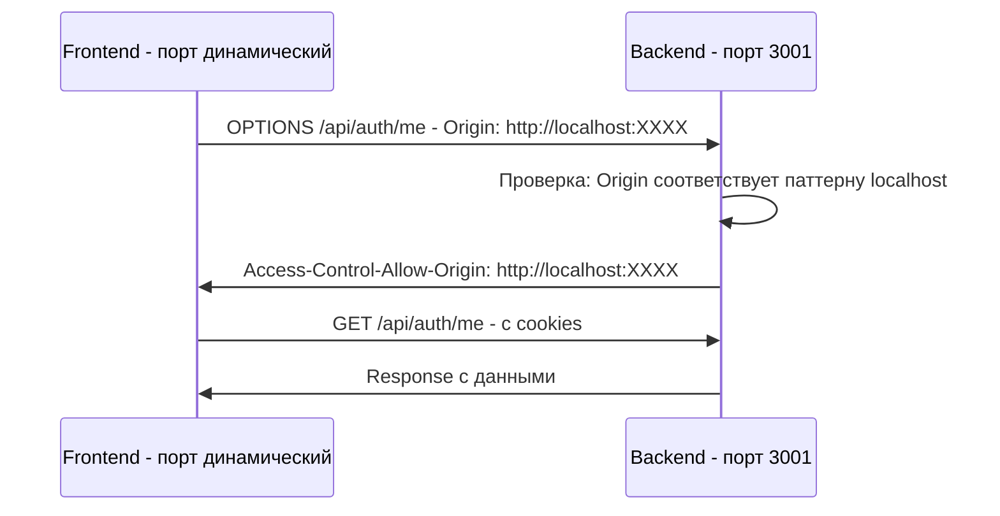

# План исправления CORS ошибки с динамическим определением порта

## Проблема

При попытке авторизации возникает CORS ошибка:
```
Cross-Origin Request Blocked: The Same Origin Policy disallows reading the remote resource at http://localhost:3001/api/auth/me. (Reason: CORS header 'Access-Control-Allow-Origin' does not match 'http://localhost:8081').
```

Frontend запускается на случайном порту вместо 3000.

## Корневые причины

### 1. Неработающая интерполяция переменных в npm скриптах

**Файл:** `package.json` (строки 11, 13)

```json
"dev:frontend": "npx serve src/frontend -l ${FRONTEND_PORT:-3000}",
"serve:frontend": "npx serve src/frontend -l ${FRONTEND_PORT:-3000}",
```

**Проблема:** Bash-синтаксис `${VAR:-default}` не работает в npm скриптах. `serve` интерпретирует строку буквально и выбирает случайный порт.

### 2. Статический CORS origin

**Файл:** `src/backend/app.ts` (строки 17-22)

```typescript
app.use(
  cors({
    origin: config.frontendUrl,  // Статическое значение
    credentials: true,
  }),
);
```

**Проблема:** CORS настроен на один статический origin, а frontend может запускаться на любом порту.

### 3. Отсутствует файл .env

Файл `.env` не создан, поэтому используются неверные fallback значения.

---

## Решение: Динамический CORS

Вместо статического CORS origin будем использовать **динамическое определение** на основе заголовка `Origin` запроса. Это позволит frontend запускаться на любом порту.

### Архитектура решения



### Шаг 1: Создать файл .env

Создать файл `.env` в корне проекта:

```env
# Server Configuration
PORT=3001
NODE_ENV=development

# Frontend Configuration - для справки, не используется в dynamic CORS
FRONTEND_PORT=3000
FRONTEND_URL=http://localhost:3000

# API Configuration
VITE_API_URL=http://localhost:3001

# Session Configuration
SESSION_DURATION_MINUTES=10

# Data Storage
DATA_DIR=./src/backend/data
```

### Шаг 2: Реализовать динамический CORS в backend

**Файл:** `src/backend/app.ts`

Заменить статический CORS на функцию-валидатор:

```typescript
import cors from 'cors';

// Функция для динамической проверки origin
const corsOptions = {
  origin: (origin: string | undefined, callback: (err: Error | null, allow?: boolean) => void) => {
    // Разрешаем запросы без origin (например, от Postman или серверных скриптов)
    if (!origin) {
      callback(null, true);
      return;
    }
    
    // В development режиме разрешаем все localhost origins
    if (config.isProduction) {
      // В production используем строгую проверку
      const allowedOrigins = [config.frontendUrl];
      if (allowedOrigins.includes(origin)) {
        callback(null, true);
      } else {
        callback(new Error('Not allowed by CORS'), false);
      }
    } else {
      // В development разрешаем любой localhost порт
      const localhostRegex = /^http:\/\/localhost(:\d+)?$/;
      if (localhostRegex.test(origin)) {
        callback(null, true);
      } else {
        callback(new Error('Not allowed by CORS'), false);
      }
    }
  },
  credentials: true,
};

app.use(cors(corsOptions));
```

### Шаг 3: Обновить конфигурацию constants.ts

**Файл:** `src/backend/config/constants.ts`

Добавить свойство `isProduction` если его нет:

```typescript
export const config = {
  port: parseInt(process.env.PORT || '3001', 10),
  nodeEnv: process.env.NODE_ENV || 'development',
  frontendUrl: process.env.FRONTEND_URL || 'http://localhost:3000',

  // Длительность сессии в минутах
  sessionDurationMinutes: parseInt(process.env.SESSION_DURATION_MINUTES || '10', 10),

  dataDir: process.env.DATA_DIR || path.join(__dirname, '../data'),

  // Вычисляемые значения
  get sessionDurationMs(): number {
    return this.sessionDurationMinutes * 60 * 1000;
  },

  get isProduction(): boolean {
    return this.nodeEnv === 'production';
  },
} as const;
```

### Шаг 4: Исправить скрипты в package.json

Заменить:
```json
"dev:frontend": "tsc -p src/frontend/tsconfig.json && npx serve src/frontend -l ${FRONTEND_PORT:-3000}",
"serve:frontend": "npx serve src/frontend -l ${FRONTEND_PORT:-3000}",
```

На:
```json
"dev:frontend": "tsc -p src/frontend/tsconfig.json && npx serve src/frontend -l 3000",
"serve:frontend": "npx serve src/frontend -l 3000",
```

### Шаг 5: Перезапустить серверы

1. Остановить все активные терминалы
2. Запустить backend: `npm run dev:backend`
3. Запустить frontend: `npm run serve:frontend`
4. Проверить, что frontend запустился на порту 3000
5. Протестировать авторизацию

---

## Ожидаемый результат

- Frontend может запускаться на **любом порту** localhost
- Backend автоматически разрешает CORS для всех `http://localhost:*`
- В production режиме используется строгая проверка origin
- Авторизация работает корректно

## Файлы для изменения

| Файл | Изменение |
|------|-----------|
| `.env` | Создать из `.env.example` |
| `src/backend/app.ts` | Реализовать динамический CORS |
| `src/backend/config/constants.ts` | Проверить наличие `isProduction` |
| `package.json` | Исправить скрипты dev:frontend и serve:frontend |

## Преимущества динамического CORS

1. **Гибкость** — Frontend может запускаться на любом доступном порту
2. **Безопасность** — В production режиме строгая проверка origin
3. **Удобство разработки** — Не нужно перенастраивать CORS при смене порта
4. **Совместимость** — Работает с любым статическим сервером (serve, http-server, и т.д.)

## Примечание о frontend API URL

Файл `src/frontend/services/api.ts` содержит hardcoded `API_BASE_URL = 'http://localhost:3001'`. Это приемлемо для данного проекта, так как:
1. Backend всегда работает на фиксированном порту 3001
2. Это не Vite проект (не поддерживает `import.meta.env`)
3. При необходимости можно вынести в конфигурацию позже
