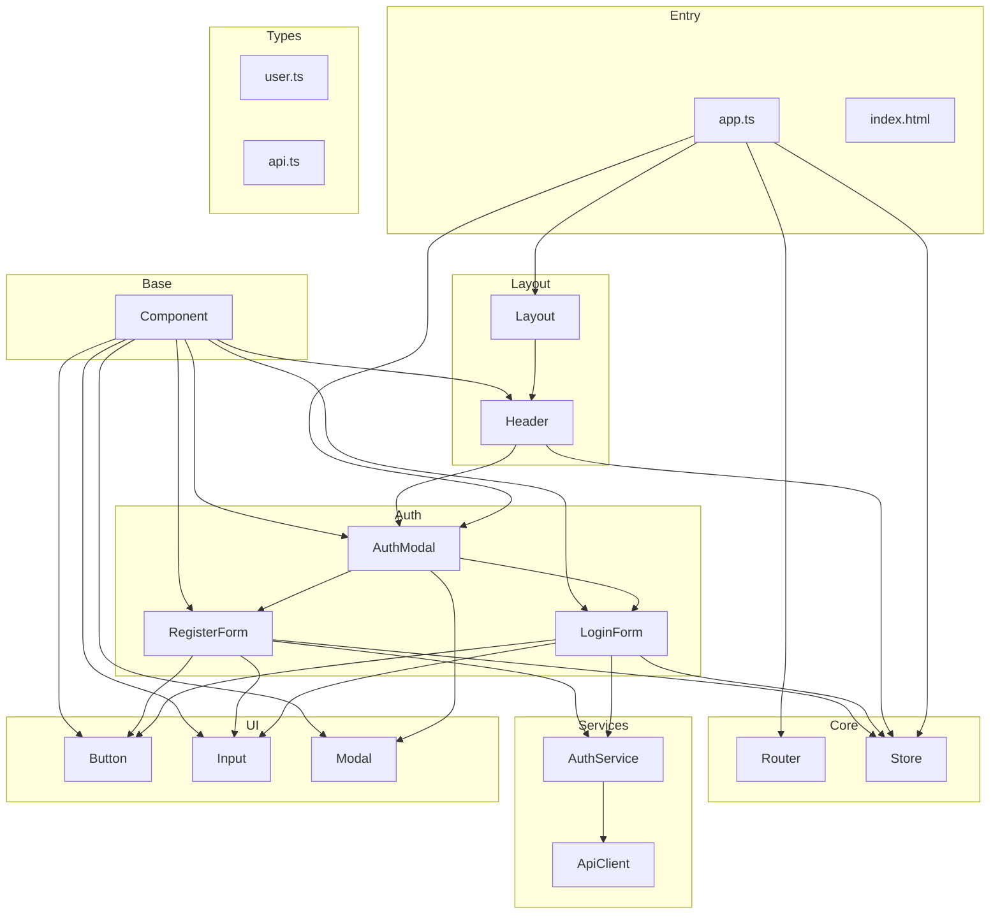
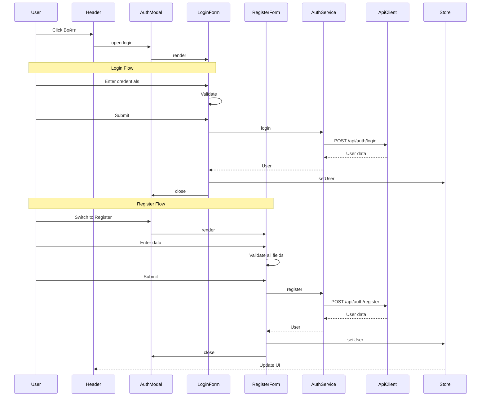
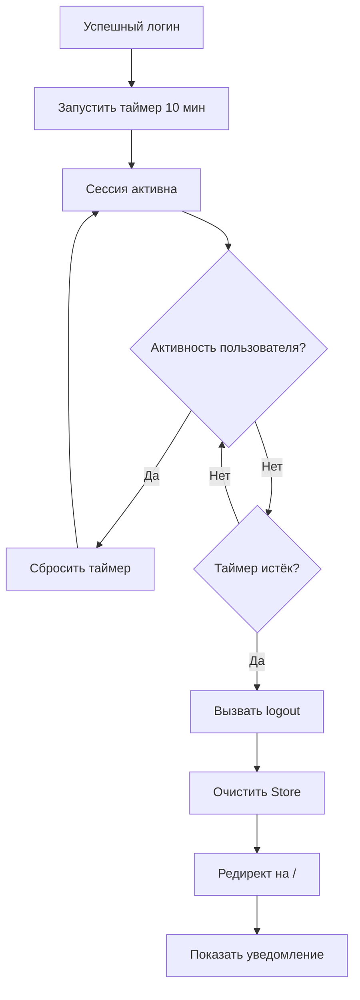

# Архитектурный план переделки фронтенда L_Shop

## Обзор

Этот план описывает переделку фронтенда L_Shop с фокусом только на задачу Глеба: базовый фундамент + авторизация. Все модули, не относящиеся к авторизации, будут удалены.

---

## 1. Архитектура компонентов

### Диаграмма компонентов



### Поток авторизации



---

## 2. Файлы для удаления

### Удалить полностью

| Файл | Причина удаления |
|------|------------------|
| [`src/frontend/pages/MainPage.ts`](src/frontend/pages/MainPage.ts) | Модуль продуктов - ответственность Никиты П. |
| [`src/frontend/components/layout/Footer.ts`](src/frontend/components/layout/Footer.ts) | Не относится к задаче авторизации |
| [`src/frontend/styles/pages/main-page.css`](src/frontend/styles/pages/main-page.css) | Стили удалённой главной страницы |

### Удалить после рефакторинга (опционально)

| Файл | Примечание |
|------|------------|
| [`src/frontend/styles/components/footer.css`](src/frontend/styles/components/footer.css) | Если Footer удалён |

---

## 3. Файлы для переделки

### 3.1 Точка входа [`app.ts`](src/frontend/app.ts)

**Текущие проблемы:**
- Импортирует `MainPage` - нужно удалить
- Импортирует `Footer` через Layout - нужно убрать

**Улучшения:**
1. Удалить импорт `MainPage`
2. Создать простую приветственную страницу или пустую страницу
3. Убрать инициализацию Footer из Layout
4. Добавить таймер автоматического разлогина (10 минут)

**Конкретные изменения:**
```typescript
// Удалить:
import { MainPage } from './pages/MainPage.js';

// Заменить на простую страницу-заглушку или компонент WelcomePage
// Добавить логику авто-разлогина:
// - Запуск таймера при успешном логине
// - Очистка таймера при активности пользователя
// - Вызов logout при истечении таймера
```

### 3.2 Layout [`Layout.ts`](src/frontend/components/layout/Layout.ts)

**Текущие проблемы:**
- Импортирует и рендерит `Footer`

**Улучшения:**
1. Удалить импорт `Footer`
2. Удалить создание и монтирование `footer`
3. Оставить только Header и main content area

**Конкретные изменения:**
```typescript
// Удалить:
import { Footer } from './Footer.js';

// Удалить свойство:
private footer: Footer | null = null;

// Удалить в render():
this.footer = new Footer();
layout.appendChild(this.footer.render());
```

### 3.3 Header [`Header.ts`](src/frontend/components/layout/Header.ts)

**Текущее состояние:**
- Хорошо реализован
- Отображает состояние авторизации
- Имеет мобильное меню

**Улучшения:**
1. Проверить корректность отображения имени пользователя
2. Добавить отображение таймера до разлогина (опционально)
3. Убедиться в корректной работе кнопки выхода

### 3.4 AuthModal [`AuthModal.ts`](src/frontend/components/auth/AuthModal.ts)

**Текущее состояние:**
- Хорошо реализован с анимациями
- Переключение между вкладками

**Улучшения:**
1. Проверить наличие `data-registration` на форме регистрации
2. Улучшить доступность (ARIA атрибуты)

### 3.5 LoginForm [`LoginForm.ts`](src/frontend/components/auth/LoginForm.ts)

**Текущее состояние:**
- Валидация полей
- Обработка ошибок API
- Переключатель видимости пароля

**Улучшения:**
1. Проверить все валидаторы
2. Улучшить сообщения об ошибках
3. Добавить индикатор загрузки

### 3.6 RegisterForm [`RegisterForm.ts`](src/frontend/components/auth/RegisterForm.ts)

**Текущее состояние:**
- **Есть `data-registration` атрибут** ✓
- Валидация всех полей
- Индикатор силы пароля

**Улучшения:**
1. Проверить корректность всех валидаторов
2. Улучшить сообщения об ошибках API
3. Проверить соответствие полей ТЗ (имя, email, логин, телефон, пароль)

### 3.7 Store [`store.ts`](src/frontend/store/store.ts)

**Текущее состояние:**
- Хорошо реализован как синглтон
- Подписки на изменения

**Улучшения:**
1. Добавить хранение времени последней активности
2. Добавить таймер сессии для авто-разлогина

### 3.8 AuthService [`auth.service.ts`](src/frontend/services/auth.service.ts)

**Текущее состояние:**
- Методы login, register, logout, getCurrentUser
- AuthEventEmitter для событий

**Улучшения:**
1. Добавить событие `session_expired` для авто-разлогина
2. Интегрировать с таймером сессии

---

## 4. Порядок переделки

### Этап 1: Удаление ненужных файлов
1. Удалить [`MainPage.ts`](src/frontend/pages/MainPage.ts)
2. Удалить [`Footer.ts`](src/frontend/components/layout/Footer.ts)
3. Удалить [`main-page.css`](src/frontend/styles/pages/main-page.css)
4. Удалить [`footer.css`](src/frontend/styles/components/footer.css)

### Этап 2: Рефакторинг Layout
1. Убрать импорт Footer из [`Layout.ts`](src/frontend/components/layout/Layout.ts)
2. Убрать создание Footer в методе render
3. Протестировать отображение

### Этап 3: Рефакторинг app.ts
1. Убрать импорт MainPage
2. Создать простую страницу-заглушку или WelcomePage
3. Реализовать логику авто-разлогина:
   - Добавить таймер в Store или отдельный сервис
   - Запускать при успешном логине
   - Сбрасывать при активности пользователя
   - Вызывать logout при истечении

### Этап 4: Проверка компонентов авторизации
1. Проверить [`RegisterForm.ts`](src/frontend/components/auth/RegisterForm.ts) - наличие `data-registration`
2. Проверить валидацию всех полей
3. Проверить обработку ошибок API
4. Проверить работу [`LoginForm.ts`](src/frontend/components/auth/LoginForm.ts)

### Этап 5: Проверка Header
1. Проверить отображение состояния авторизации
2. Проверить работу кнопки выхода
3. Проверить корректность навигации

### Этап 6: Тестирование
1. Запустить линтер: `npm run lint`
2. Запустить форматтер: `npm run format`
3. Запустить тесты: `npm test`
4. Проверить E2E тесты: `npm run test:e2e`

---

## 5. Чек-лист для проверки

### Обязательные требования из ТЗ

- [ ] **Форма регистрации с `data-registration`**
  - Проверить наличие атрибута на форме
  - Поля: имя, email, логин, телефон, пароль

- [ ] **Форма авторизации**
  - Поля: логин/email, пароль
  - Валидация

- [ ] **Валидация всех полей**
  - Имя - обязательное
  - Email - формат email
  - Логин - обязательное
  - Телефон - формат +1234567890
  - Пароль - минимум 6 символов

- [ ] **Обработка ошибок API**
  - Отображение ошибок под полями
  - Общие ошибки формы

- [ ] **Автоматический разлогин через 10 минут**
  - Таймер сессии
  - Сброс при активности
  - Редирект на главную

- [ ] **Header с отображением состояния авторизации**
  - Для гостей: кнопка "Войти"
  - Для авторизованных: имя + "Выйти"

- [ ] **URL-маршрутизация**
  - History API
  - Навигация без перезагрузки

### Код-стайл

- [ ] Нет `any` типов
- [ ] Все функции типизированы
- [ ] JSDoc комментарии на публичных методах
- [ ] Именование: camelCase для переменных/функций, PascalCase для классов
- [ ] Форматирование: 2 пробела, строка до 100 символов

### Тестирование

- [ ] Линтер проходит без ошибок
- [ ] Форматтер не меняет файлы
- [ ] Unit тесты проходят
- [ ] E2E тесты проходят

---

## 6. Новая структура файлов

После переделки структура фронтенда будет:

```
src/frontend/
├── index.html
├── app.ts                      # Точка входа (обновить)
├── tsconfig.json
├── vite-env.d.ts
├── components/
│   ├── base/
│   │   └── Component.ts        # Без изменений
│   ├── auth/
│   │   ├── AuthModal.ts        # Проверить
│   │   ├── LoginForm.ts        # Проверить
│   │   └── RegisterForm.ts     # Проверить data-registration
│   ├── layout/
│   │   ├── Header.ts           # Проверить
│   │   └── Layout.ts           # Убрать Footer
│   └── ui/
│       ├── Button.ts           # Без изменений
│       ├── Input.ts            # Без изменений
│       └── Modal.ts            # Без изменений
├── router/
│   └── router.ts               # Без изменений
├── services/
│   ├── api.ts                  # Без изменений
│   └── auth.service.ts         # Добавить session_expired
├── store/
│   └── store.ts                # Добавить таймер сессии
├── styles/
│   ├── design-tokens.css       # Без изменений
│   ├── main.css                # Без изменений
│   ├── utilities.css           # Без изменений
│   ├── variables.css           # Без изменений
│   └── components/
│       ├── button.css          # Без изменений
│       ├── forms.css           # Без изменений
│       ├── header.css          # Без изменений
│       ├── input.css           # Без изменений
│       ├── layout.css          # Без изменений
│       └── modal.css           # Без изменений
└── types/
    ├── api.ts                  # Без изменений
    └── user.ts                 # Без изменений
```

---

## 7. Реализация авто-разлогина

### Алгоритм



### Код для добавления в Store

```typescript
// В store.ts добавить:
private sessionTimer: NodeJS.Timeout | null = null;
private readonly SESSION_TIMEOUT = 10 * 60 * 1000; // 10 минут

public startSessionTimer(onExpire: () => void): void {
  this.clearSessionTimer();
  this.sessionTimer = setTimeout(() => {
    onExpire();
  }, this.SESSION_TIMEOUT);
}

public clearSessionTimer(): void {
  if (this.sessionTimer) {
    clearTimeout(this.sessionTimer);
    this.sessionTimer = null;
  }
}

public resetSessionTimer(onExpire: () => void): void {
  this.startSessionTimer(onExpire);
}
```

### Код для добавления в app.ts

```typescript
// Отслеживание активности пользователя
private setupActivityTracking(): void {
  const events = ['mousedown', 'keydown', 'scroll', 'touchstart'];
  
  events.forEach(event => {
    document.addEventListener(event, () => {
      store.resetSessionTimer(() => this.handleSessionExpired());
    }, { passive: true });
  });
}

private handleSessionExpired(): void {
  AuthService.logout();
  store.setUser(null);
  router.navigate('/');
  // Показать уведомление
}
```

---

## 8. Риски и зависимости

### Риски
1. **Удаление MainPage** - может сломать роутер, нужно обновить маршруты
2. **Авто-разлогин** - нужно тщательно протестировать
3. **Удаление Footer** - может повлиять на layout

### Зависимости
1. Backend API должен быть запущен для тестирования
2. E2E тесты должны быть обновлены после изменений

---

## 9. Итог

После выполнения этого плана фронтенд будет содержать только:
- Базовый фундамент (Component, Router, Store, API клиент)
- Компоненты авторизации (AuthModal, LoginForm, RegisterForm)
- Layout (Header, Layout без Footer)
- UI компоненты (Button, Input, Modal)

Всё лишнее будет удалено, а код будет соответствовать CODING_STANDARDS.md.
